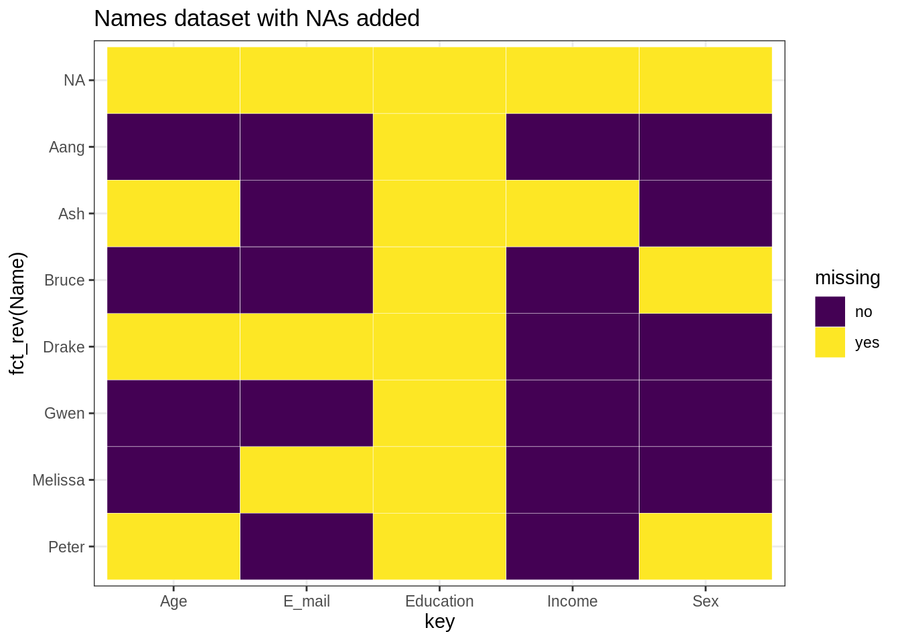
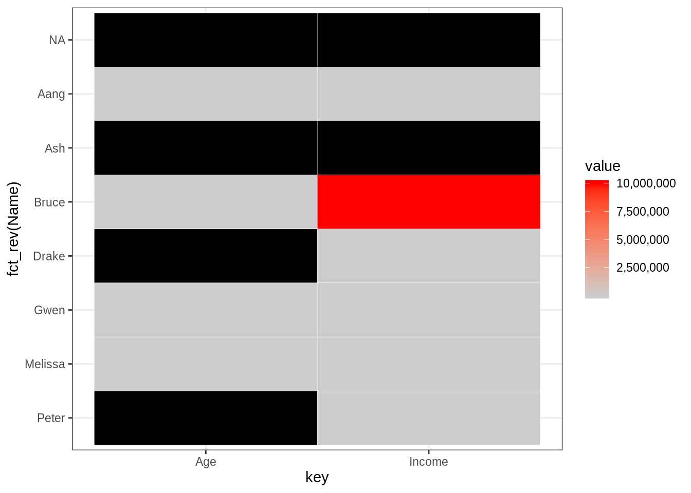
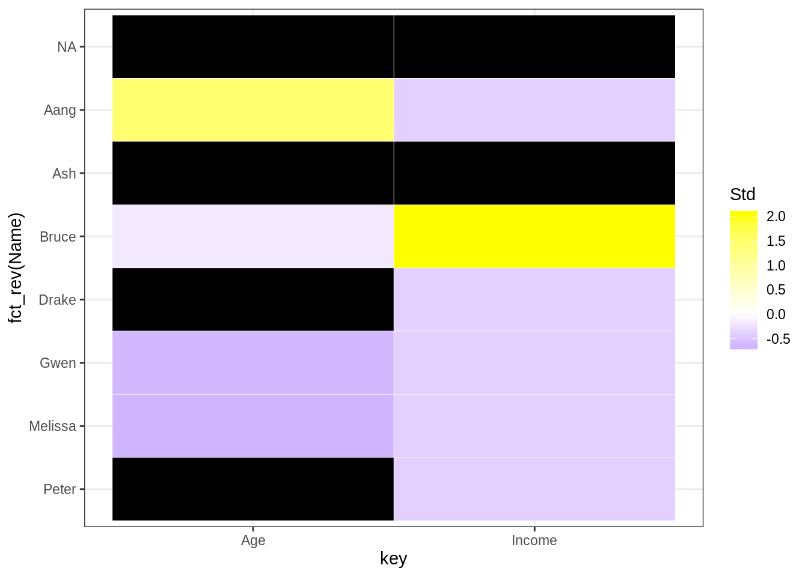
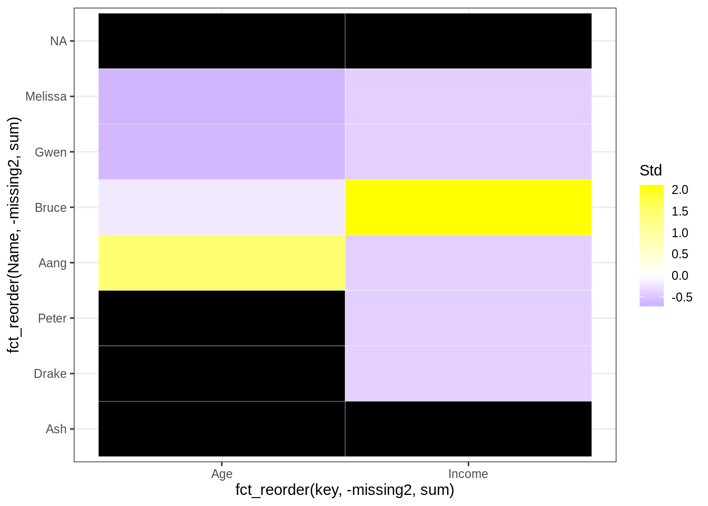
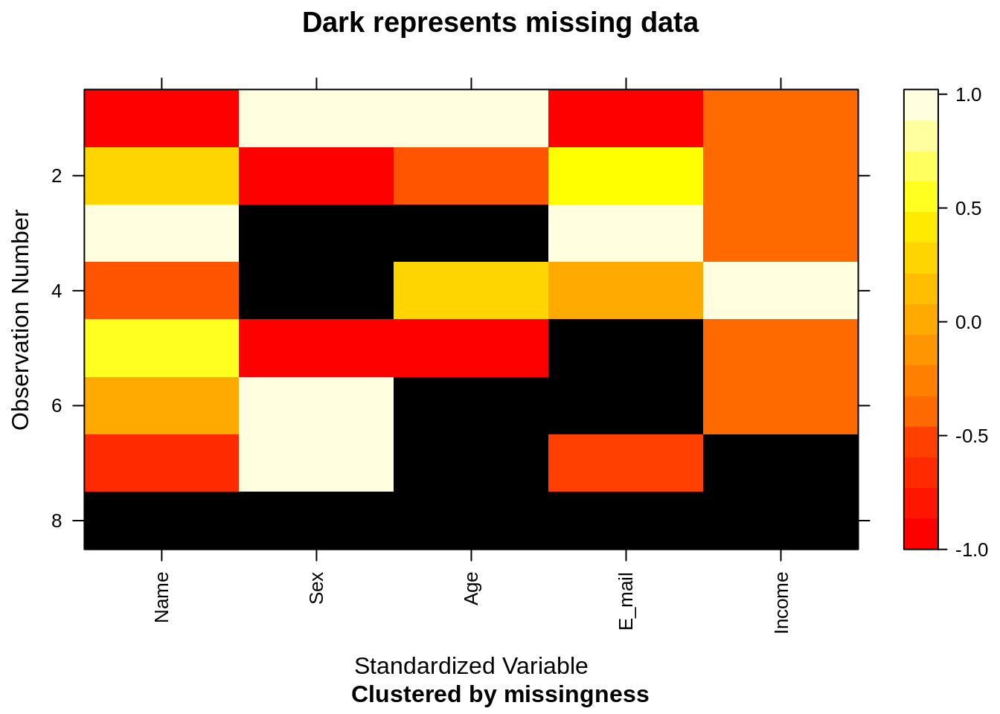
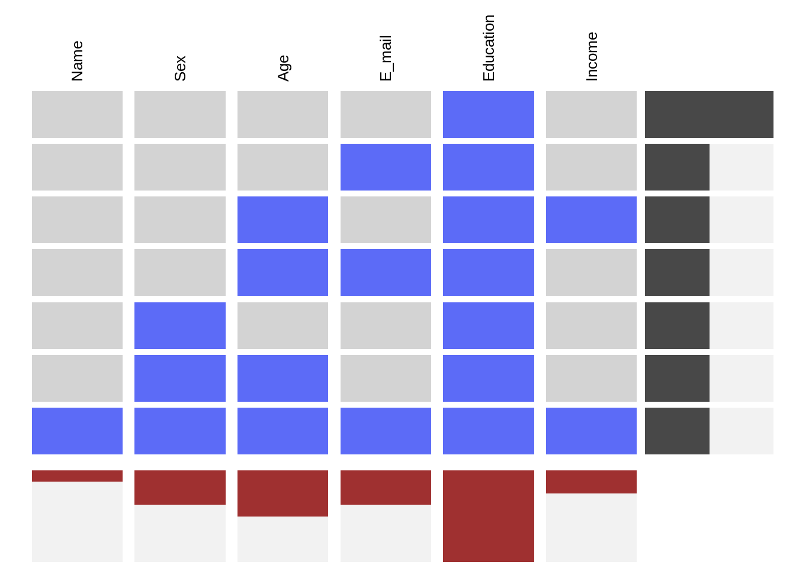
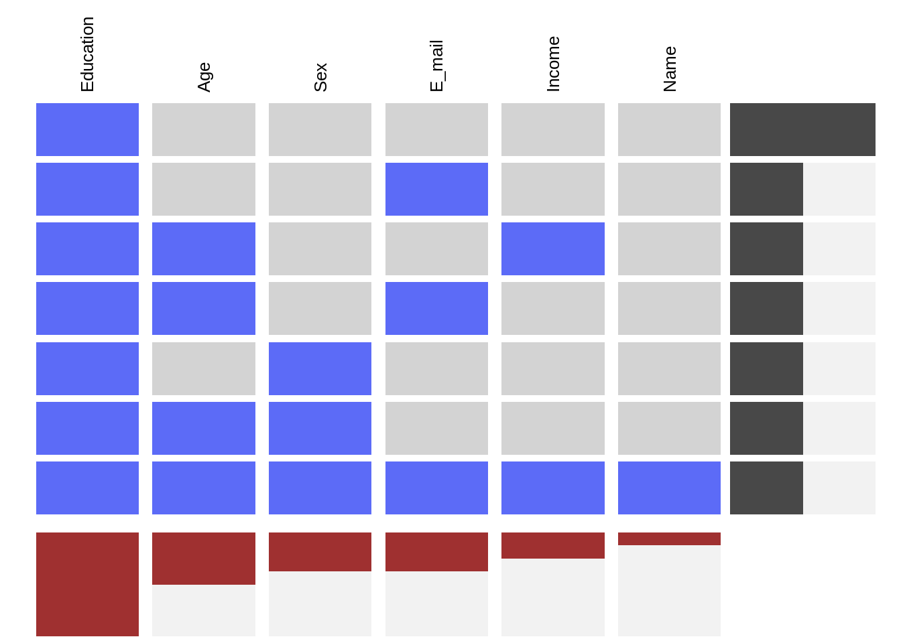

# Missing Data {#missing}


*This chapter originated as a community contribution created by [ujjwal95](https://github.com/ujjwal95){target="_blank"}*

*This page is a work in progress. We appreciate any input you may have. If you would like to help improve this page, consider [contributing to our repo](contribute.html).*

## Overview
This section covers what kinds of missing values are encountered in data and how to handle them.

## tl;dr
It's difficult to handle missing data! If your data has some missing values, which it most likely will, you can either remove such rows, such columns, or impute them.

## What are NAs?

Whenever data in some row or column in your data is missing, it comes up as NA. Let's have a look at some data, shall we?


Name      Sex       Age  E_mail                    Education     Income
--------  -------  ----  ------------------------  ----------  --------
Melissa   Female     27  NA                        NA           1.0e+04
Peter     NA         NA  peter.parker@esu.edu      NA           7.5e+03
Aang      Male      110  aang@avatars.com          NA           1.0e+03
Drake     Male       NA  NA                        NA           5.0e+04
Bruce     NA         45  bruce.wayne@wayne.org     NA           1.0e+07
Gwen      Female     28  gwen.stacy@esu.edu        NA           2.3e+04
Ash       Male       NA  ash.ketchum@pokemon.com   NA                NA
NA        NA         NA  NA                        NA                NA

We can see the number of NAs in each column and row:

```r
colSums(is.na(data))
```

```
##      Name       Sex       Age    E_mail Education    Income 
##         1         3         4         3         8         2
```


```r
rowSums(is.na(data))
```

```
## [1] 2 3 1 3 2 1 3 6
```

We can also see the ratio of the number of NAs in each column and row:

```r
colMeans(is.na(data))
```

```
##      Name       Sex       Age    E_mail Education    Income 
##     0.125     0.375     0.500     0.375     1.000     0.250
```


```r
rowMeans(is.na(data))
```

```
## [1] 0.3333333 0.5000000 0.1666667 0.5000000 0.3333333 0.1666667 0.5000000
## [8] 1.0000000
```

## Types of Missing Data

- **Missing Completely at Random (MCAR)**: These are missing data values which are not related to any missing or non-missing values in other columns in the data.

- **Missing at Random (MAR)**: These are missing data which are linked to one or more groups in the data. The great thing about MAR is that MAR values can be predicted using other features. For example, it may be observed that people older than 70 generally do not enter their income. 
Most of the data we encounter is MAR.

- **Missing Not at Random (MNAR)**: Generally, data which is not MAR is MNAR. A big problem is that there is not a huge distinction between MAR and MNAR. We generally assume MAR, unless otherwise known by an outside source.

## Missing Patterns 

### Missing Patterns by columns

We can see some missing patterns in data by columns,


```r
ggplot(tidy_names, aes(x = key, y = fct_rev(Name), fill = missing)) +
  geom_tile(color = "white") + 
  ggtitle("Names dataset with NAs added") +
  scale_fill_viridis_d() +
  theme_bw()
```



And we can also add a scale to check the numerical values available in the dataset and look for any trends:

```r
library(scales) # for legend
# Select columns having numeric values
numeric_col_names <- colnames(select_if(data, is.numeric))
filtered_for_numeric <- tidy_names[tidy_names$key %in% numeric_col_names,]
filtered_for_numeric$value <- as.integer(filtered_for_numeric$value)
# Use label=comma to remove scientific notation
ggplot(data = filtered_for_numeric, aes(x = key, y = fct_rev(Name), fill = value)) +
  geom_tile(color = "white") + 
  scale_fill_gradient(low = "grey80", high = "red", na.value = "black", label=comma) + 
  theme_bw()
```



Can you see the problem with the above graph? Notice that the scale is for *all* the variables, hence it cannot show the variable level differences!
To solve this problem, we can standardize the variables:

```r
filtered_for_numeric <- filtered_for_numeric %>% 
  group_by(key) %>% 
  mutate(Std = (value-mean(value, na.rm = TRUE))/sd(value, na.rm = TRUE)) %>% 
  ungroup()

ggplot(filtered_for_numeric, aes(x = key, y = fct_rev(Name), fill = Std)) +
  geom_tile(color = "white") + 
  scale_fill_gradient2(low = "blue", mid = "white", high ="yellow", na.value = "black") + theme_bw()
```



Now, we can see the missing trends better! Let us sort them by the number missing by each row and column:

```r
# convert missing to numeric so it can be summed up
filtered_for_numeric <- filtered_for_numeric %>% 
  mutate(missing2 = ifelse(missing == "yes", 1, 0))

ggplot(filtered_for_numeric, aes(x = fct_reorder(key, -missing2, sum), y = fct_reorder(Name, -missing2, sum), fill = Std)) +
  geom_tile(color = "white") + 
  scale_fill_gradient2(low = "blue", mid = "white", high ="yellow", na.value = "black") + theme_bw()
```



### Missing Patterns by rows

We can also see missing patterns in data by rows using the `mi` package:

```r
library(mi)
x <- missing_data.frame(data)
```

```
## Warning in .guess_type(y, favor_ordered, favor_positive, threshold,
## variable_name): Education : cannot infer variable type when all values are
## NA, guessing 'irrelevant'
```

```
## NOTE: In the following pairs of variables, the missingness pattern of the second is a subset of the first.
##  Please verify whether they are in fact logically distinct variables.
##      [,1]        [,2]    
## [1,] "Age"       "Income"
## [2,] "Education" "Income"
```

```
## Warning in .local(.Object, ...): Some observations are missing on all included variables.
## Often, this indicates a more complicated model is needed for this missingness mechanism
```

```r
image(x)
```



Did you notice that the `Education` variable has been skipped? That is because the whole column is missing.
Let us try to see some patterns in the missing data:

```r
x@patterns
```

```
## [1] E_mail                         Sex, Age                      
## [3] nothing                        Age, E_mail                   
## [5] Sex                            nothing                       
## [7] Age, Income                    Name, Sex, Age, E_mail, Income
## 7 Levels: nothing E_mail Sex Sex, Age Age, E_mail ... Name, Sex, Age, E_mail, Income
```


```r
levels(x@patterns)
```

```
## [1] "nothing"                        "E_mail"                        
## [3] "Sex"                            "Sex, Age"                      
## [5] "Age, E_mail"                    "Age, Income"                   
## [7] "Name, Sex, Age, E_mail, Income"
```


```r
summary(x@patterns)
```

```
##                        nothing                         E_mail 
##                              2                              1 
##                            Sex                       Sex, Age 
##                              1                              1 
##                    Age, E_mail                    Age, Income 
##                              1                              1 
## Name, Sex, Age, E_mail, Income 
##                              1
```

We can visualize missing patterns using the `visna` (VISualize NA) function in the `extracat` package:

```r
extracat::visna(data)
```

```
## Warning in melt(as.data.frame(xs), ncol(xs)): The melt generic in
## data.table has been passed a data.frame and will attempt to redirect to the
## relevant reshape2 method; please note that reshape2 is deprecated, and this
## redirection is now deprecated as well. To continue using melt methods from
## reshape2 while both libraries are attached, e.g. melt.list, you can prepend
## the namespace like reshape2::melt(as.data.frame(xs)). In the next version,
## this warning will become an error.
```



Here, the rows represent a missing pattern and the columns represent the column level missing values. The advantage of this graph is that it shows you only the missing patterns available in the data, not all the possible combinations of data (which will be 2^6 = 64), so that you can focus on the pattern in the data itself. 

We can sort the graph by most to least common missing pattern (i.e., by row):

```r
extracat::visna(data, sort = "r")
```

```
## Warning in melt(as.data.frame(xs), ncol(xs)): The melt generic in
## data.table has been passed a data.frame and will attempt to redirect to the
## relevant reshape2 method; please note that reshape2 is deprecated, and this
## redirection is now deprecated as well. To continue using melt methods from
## reshape2 while both libraries are attached, e.g. melt.list, you can prepend
## the namespace like reshape2::melt(as.data.frame(xs)). In the next version,
## this warning will become an error.
```


Or, by most to least missing values (i.e., by column):

```r
extracat::visna(data, sort = "c")
```

```
## Warning in melt(as.data.frame(xs), ncol(xs)): The melt generic in
## data.table has been passed a data.frame and will attempt to redirect to the
## relevant reshape2 method; please note that reshape2 is deprecated, and this
## redirection is now deprecated as well. To continue using melt methods from
## reshape2 while both libraries are attached, e.g. melt.list, you can prepend
## the namespace like reshape2::melt(as.data.frame(xs)). In the next version,
## this warning will become an error.
```



Or, by both row and column sort:

```r
extracat::visna(data, sort = "b")
```

```
## Warning in melt(as.data.frame(xs), ncol(xs)): The melt generic in
## data.table has been passed a data.frame and will attempt to redirect to the
## relevant reshape2 method; please note that reshape2 is deprecated, and this
## redirection is now deprecated as well. To continue using melt methods from
## reshape2 while both libraries are attached, e.g. melt.list, you can prepend
## the namespace like reshape2::melt(as.data.frame(xs)). In the next version,
## this warning will become an error.
```


## Handling Missing values

There are multiple methods to deal with missing values.

### Deletion of rows containing NAs

Often we would delete rows that contain NAs when we are handling Missing Completely at Random data.
We can delete the rows having NAs as below:

```r
na.omit(data)
```

```
## [1] Name      Sex       Age       E_mail    Education Income   
## <0 rows> (or 0-length row.names)
```

This method is called *list-wise deletion*. It removes all the rows having NAs. But we can see that the Education column is only NAs, so we can remove that column itself:

```r
edu_data <- data[, !(colnames(data) %in% c("Education"))]
na.omit(edu_data)
```

```
##   Name    Sex Age             E_mail Income
## 3 Aang   Male 110   aang@avatars.com   1000
## 6 Gwen Female  28 gwen.stacy@esu.edu  23000
```

Another method is *pair-wise deletion*, in which only the rows having missing values in the variable of interest are removed.

### Imputation Techniques

Imputation means to replace missing data with substituted values. These techniques are generally used with MAR data.

#### Mean/Median/Mode Imputation

We can replace missing data in continuous variables with their mean/median and missing data in discrete/categorical variables with their mode.

Either we can replace all the values in the missing variable directly, for example, if "Income" has a median of 15000, we can replace all the missing values in "Income" with 15000, in a technique known as *Generalized Imputation*.

Or, we can replace all values on a similar case basis. For example, we notice that the income of people with `Age > 60` is much less than those with `Age < 60`, on average, and hence we calculate the median income of each `Age` group separately, and impute values separately for each group.

The problem with these methods is that they disturb the underlying distribution of the data.

### Model Imputation
There are several model based approaches for imputation of data, and several packages, like [mice](https://cran.r-project.org/web/packages/mice/index.html){target="_blank"}, [Hmisc](https://cran.r-project.org/web/packages/Hmisc/index.html){target="_blank"}, and [Amelia II](https://cran.r-project.org/web/packages/Amelia/index.html){target="_blank"}, which deal with this.

For more info, checkout [this blog on DataScience+ about imputing missing data with the R mice package](https://datascienceplus.com/imputing-missing-data-with-r-mice-package/){target="_blank"}.

## External Resources
- [Missing Data Imputation](http://www.stat.columbia.edu/~gelman/arm/missing.pdf){target="_blank"} - A PDF by the Stats Department at Columbia University regarding Missing-data Imputation
- [How to deal with missing data in R](https://datascienceplus.com/missing-values-in-r/){target="_blank"} - A 2 min read blogpost in missing data handling in R
- [Imputing Missing Data in R; MICE package](https://datascienceplus.com/imputing-missing-data-with-r-mice-package/){target="_blank"} - A 9 min read on how to use the `mice` package to impute missing values in R
- [How to Handle Missing Data](https://towardsdatascience.com/how-to-handle-missing-data-8646b18db0d4){target="_blank"} - A great blogpost on how to handle missing data.


