# (PART) Multivariate Categorical {-}

# Chart: Mosaic {#mosaic}

<!-- Chapter Banner -->

*This chapter originated as a community contribution created by [harin](https://github.com/harin){target="_blank"}*

*This page is a work in progress. We appreciate any input you may have. If you would like to help improve this page, consider [contributing to our repo](contribute.html).*


## Overview

This section covers how to make Mosaic plots

## tl;dr


```r
library(vcd)
mosaic(Favorite ~ Age + Music, 
       labeling = labeling_border(
         abbreviate_labs = c(3, 10, 6),
         rot_labels=c(0,0,-45)
       ),
       direction=c('v','v','h'), # Age = Vertical, Music = Vertical, Favoriate = Horizonal (a.k.a DoubleDecker)
       gp = gpar(fill=c('lightblue', 'gray')),
       df)
```

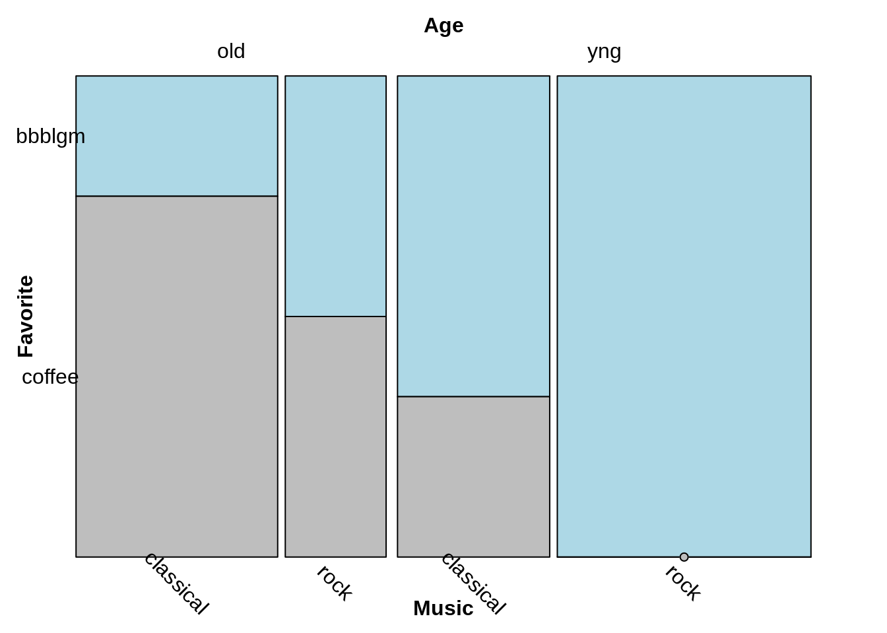

## Simple Example Walkthrough

### Order of splits

It is best to draw mosaic plots incrementally: start with splitting on one variable and then add additional variables one at a time. The full mosaic plot will have one split per variable.

Important: if your data is in a data frame, as in the example below, **the count column must be called `Freq`**. (Tables and matrices also work, see `?vcd::structable` for more details.)

Also note that all of these plots are drawn with `vcd::mosaic()` not the base R function, `mosaicplot()`.

The data:

```r
df
```

```
##     Age   Favorite     Music Freq
## 1   old bubble gum classical    1
## 2   old bubble gum      rock    1
## 3   old     coffee classical    3
## 4   old     coffee      rock    1
## 5 young bubble gum classical    2
## 6 young bubble gum      rock    5
## 7 young     coffee classical    1
## 8 young     coffee      rock    0
```

Split on `Age` only:


```r
library(vcd)
mosaic(~Age, df)
```

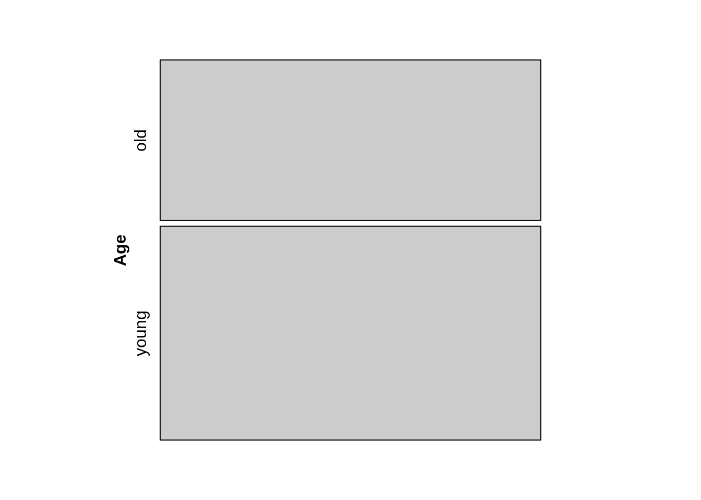

Split on `Age`, then `Music`:


```r
mosaic(Music ~ Age, df)
```

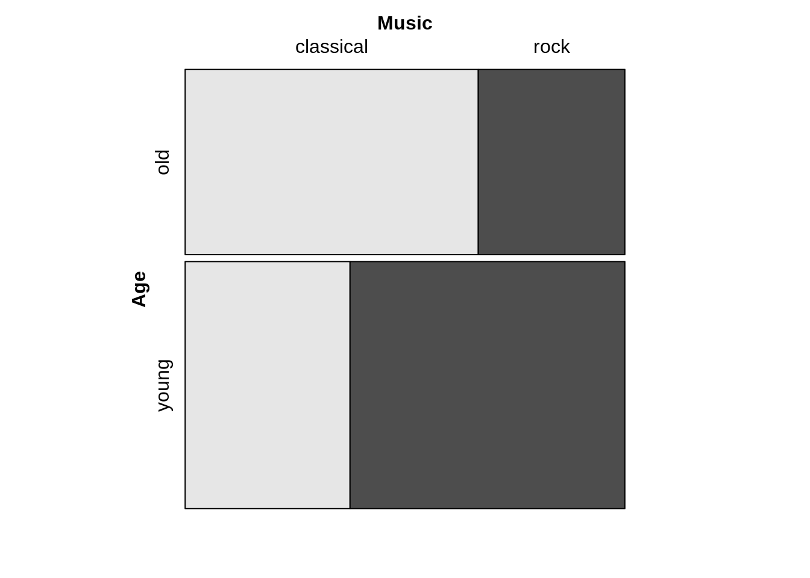

Note that the *first* split is between "young" and "old", while the second set of splits divides each age group into "classical" and "rock".

Split on `Age`, then `Music`, then `Favorite`:


```r
mosaic(Favorite ~ Age + Music, df)
```


### Direction of splits

Note that in the previous example, the direction of the splits is as follows:

1.  `Age` -- horizontal split

2.  `Music` -- vertical split

3.  `Favorite` -- horizontal split

This is the default direction pattern: alternating directions beginning with horizontal. Therefore we get the same plot with the following:


```r
mosaic(Favorite ~ Age + Music, 
       direction = c("h", "v", "h"), df)
```

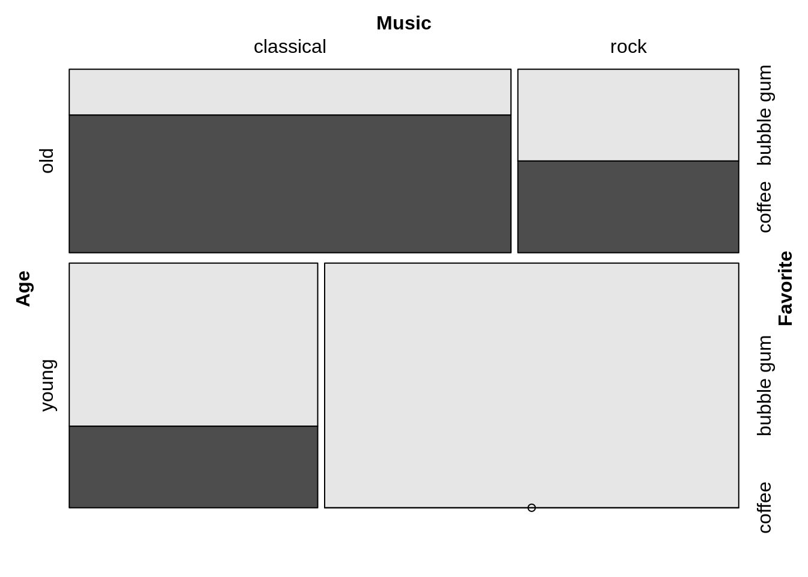

The directions can be altered as desired. For example, to create a doubledecker plot, make all splits vertical except the last one:


```r
mosaic(Favorite ~ Age + Music,
       direction = c("v", "v", "h"), df)
```

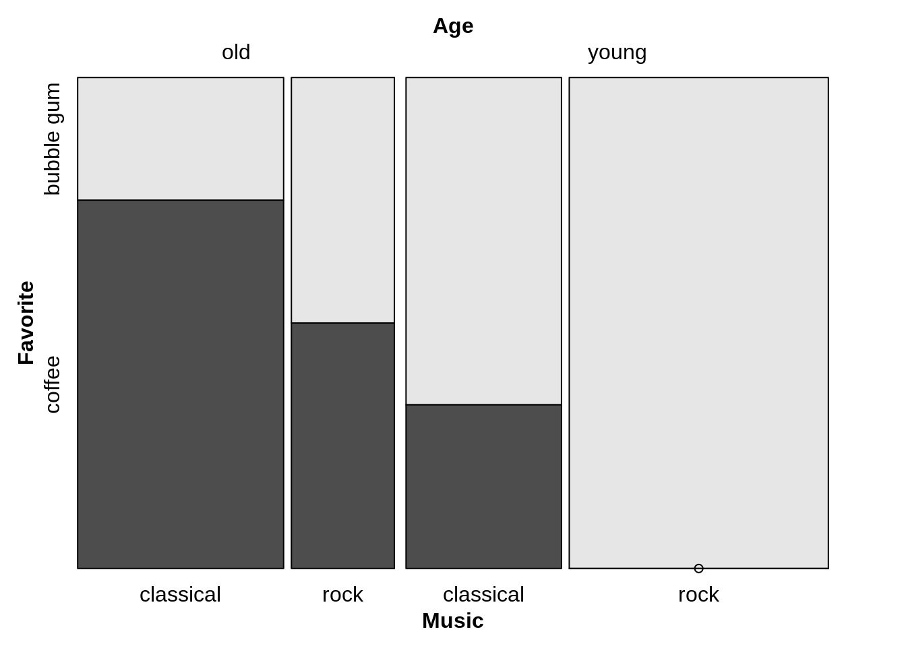

Note that the direction vector is in order of splits (`Age`, `Music`, `Favorite`), not in the order in which the variables appear in the formula, where the last variable to be split is listed first, before the "~".

### Options

#### Fill color:


```r
library(grid) # needed for gpar
mosaic(Favorite ~ Age + Music, 
       gp = gpar(fill = c("lightblue", "blue")),
       df)
```

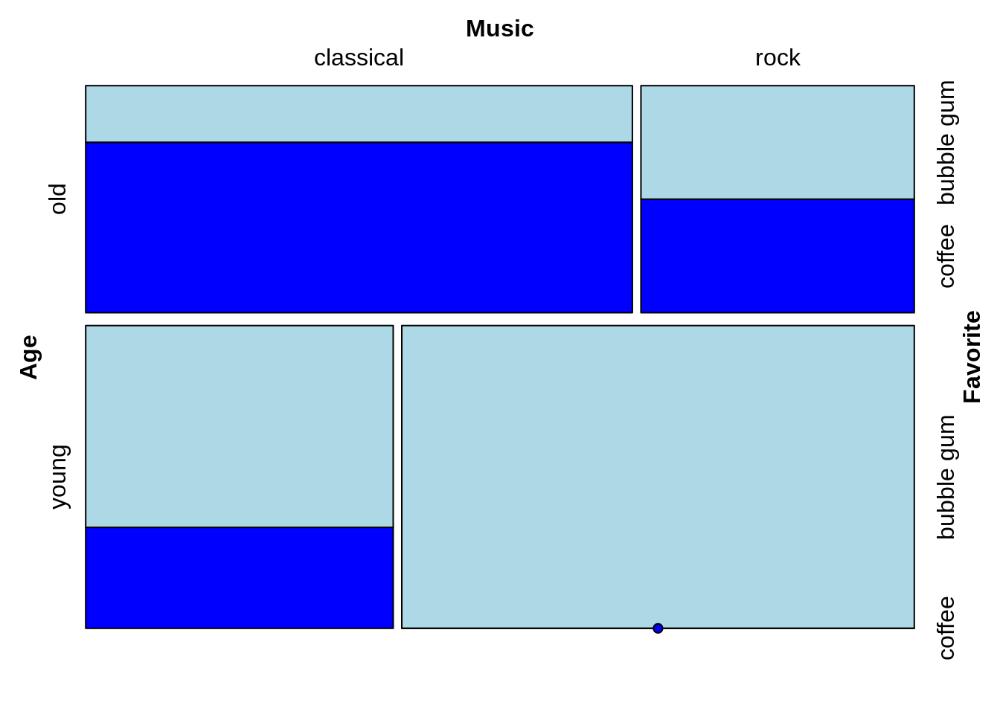

#### Rotate labels:


```r
mosaic(Favorite ~ Age + Music, 
       labeling = labeling_border(rot_labels = c(45, -45, 0, 0)),
       df)
```

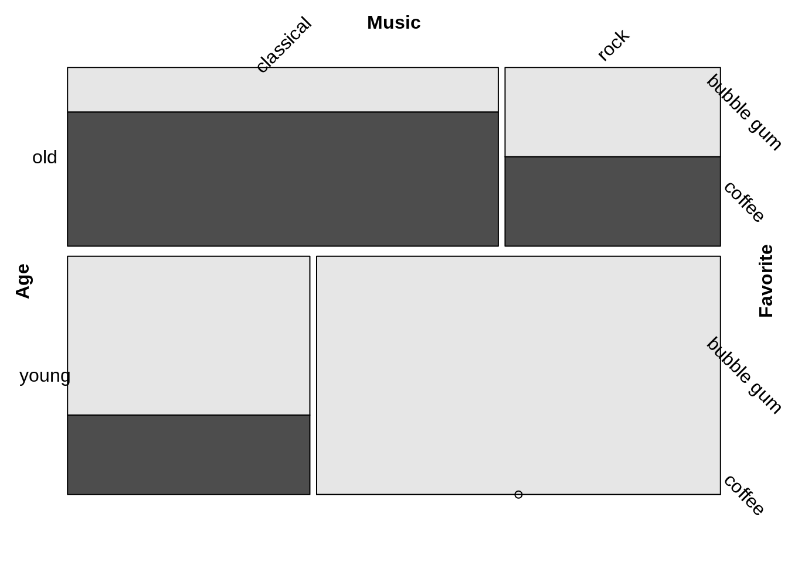

The `rot_labels =` vector sets the rotation in degrees on the four sides of the plot in this order: *top, right, bottom, left*. (Different from the typical base graphics order!) The default is `rot_labels = c(0, 90, 0, 90)`.

#### Abbreviate labels:


```r
mosaic(Favorite ~ Age + Music, 
       labeling = labeling_border(abbreviate_labs = c(3, 1, 6)), 
       df)
```


Labels are abbreviated in the order of the splits (as for `direction =`). The abbreviation algorithm appears to return the specified number of characters after vowels are eliminated (if necessary).

For more formatting options, see `>?vcd::labeling_border`.

#### Remove spacing between cells


```r
mosaic(Favorite ~ Age + Music,
       spacing = spacing_equal(sp = unit(0, "lines")),
       df)
```


For more details, see `>?vcd::spacings`

#### Change border color (must also set fill(?))


```r
mosaic(Favorite ~ Age + Music,
       gp = gpar(fill = c("lightblue", "blue"),
                 col = "white"),
       spacing = spacing_equal(sp = unit(0, "lines")),
       df)
```

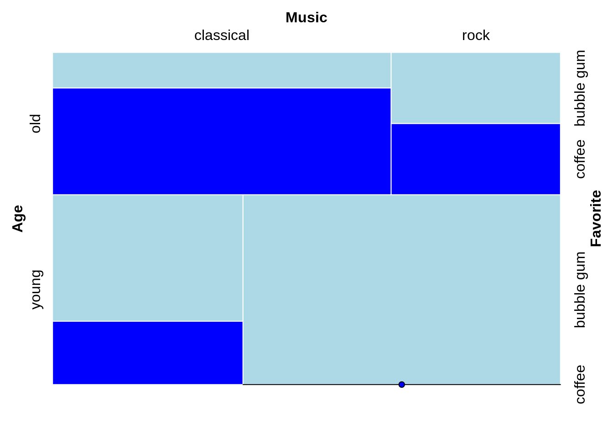


### Mosaic using vcd::doubledecker


```r
data(Arthritis)
vcd::doubledecker(Improved ~ Treatment + Sex, data=Arthritis)
```

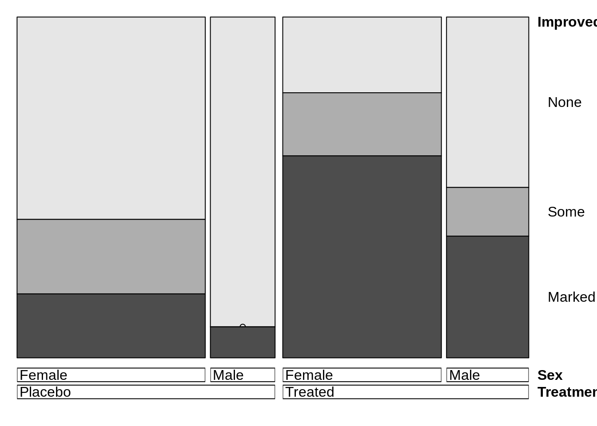


```r
vcd::doubledecker(Music ~ Favorite + Age, 
                  xtabs(Freq ~ Age + Music + Favorite, df))
```

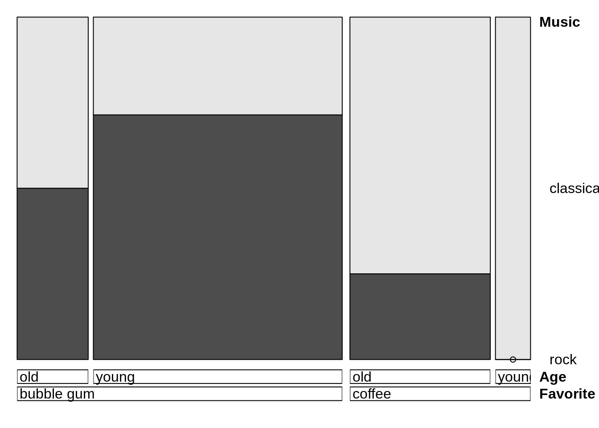

## Mosaic using ggplot

For a comprehensive overview of mosaic plot in ggplot check out the link below.
[https://cran.r-project.org/web/packages/ggmosaic/vignettes/ggmosaic.html](https://cran.r-project.org/web/packages/ggmosaic/vignettes/ggmosaic.html){target="_blank"}


```r
library(ggmosaic)

# equivalent to doing Favorite ~ Age + Music in vcd::mosaic with doubledecker style cut
ggplot(df) + 
  geom_mosaic(
    aes(x=product(Favorite, Age, Music), # cut from right to left 
        weight=Freq,
        fill=Favorite
        ),
    divider=c("vspine" , "hspine", "hspine") # equivalent to divider=ddecker()
  ) 
```

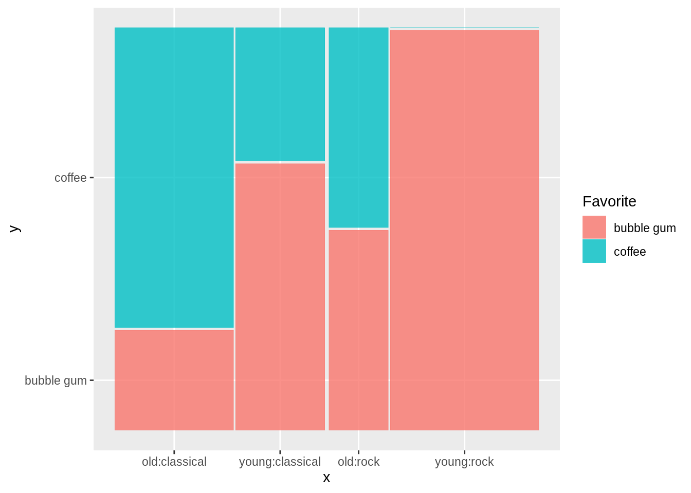


## Theory

## When to use

When you want to see the relationships in Multivariate Categorical Data

## Considerations

### Labels

Legibility of the labels is problematic in mosaic plot especially when there are a lot of dimensions. This can be alleviated by
- Abbreviate names
- Rotating the labels

### Aspect Ratio
- lengths are easier to judge than area, so try to use rectangles with same width or height
- Taller thinner rectangles are better (we are better at distinguishing length than area)

### Gaps between rectangles
- No gap = most efficient

However, a gap can help improve legibility, so try out different combinations

- Can have a gap at splits
- Can Vary gap size down the hierarchy

### Color
- good for rates in the subgroup
- displaying residual
- emphasizing particular subgroup

## External resources

- Chapter 7 of [Graphical data analysis with R by Anthony Unwin](https://www.crcpress.com/Graphical-Data-Analysis-with-R/Unwin/p/book/9781498715232){target="_blank"}

- [Link](https://cran.r-project.org/web/packages/ggmosaic/vignettes/ggmosaic.html){target="_blank"}: A comprehensive overview of mosaic plot in ggplot check out the link below.
