# Themes and Palettes {#themes}


*This chapter originated as a community contribution created by [ar3879](https://github.com/Akanksha1Raj){target="_blank"}*
  
  *This page is a work in progress. We appreciate any input you may have. If you would like to help improve this page, consider [contributing to our repo](contribute.html).*


## Overview
 
  Our graphs have to be informative and attractive to the audience to get their attention. Themes and colors play an important role in making the graphs attractive.
  
  This section covers how we can set different palettes and themes to suit the context and to make them look cool.
  
## ggplot2 themes
  
  In `ggplot2`, we do have a set of themes, which we can set. A brief description of them is as follows:
  
  * `theme_gray()`: signature `ggplot2` theme
  * `theme_bw()`: dark on light `ggplot2` theme
  * `theme_linedraw()`: uses black lines on white backgrounds only
  * `theme_light()`: similar to `linedraw()` but with grey lines as well
  * `theme_dark()`: lines on a dark background instead of light
  * `theme_minimal()`: no background annotations, minimal feel
  * `theme_classic()`: theme with no grid lines
  * `theme_void()`: empty theme with no elements
  
### ggplot2 theme example
  

```r
q <- ggplot(subset, aes(x = clarity, y = carat, color = cut)) +
  geom_point(size = 2.5,alpha = 0.75) 

q + theme_minimal()
```

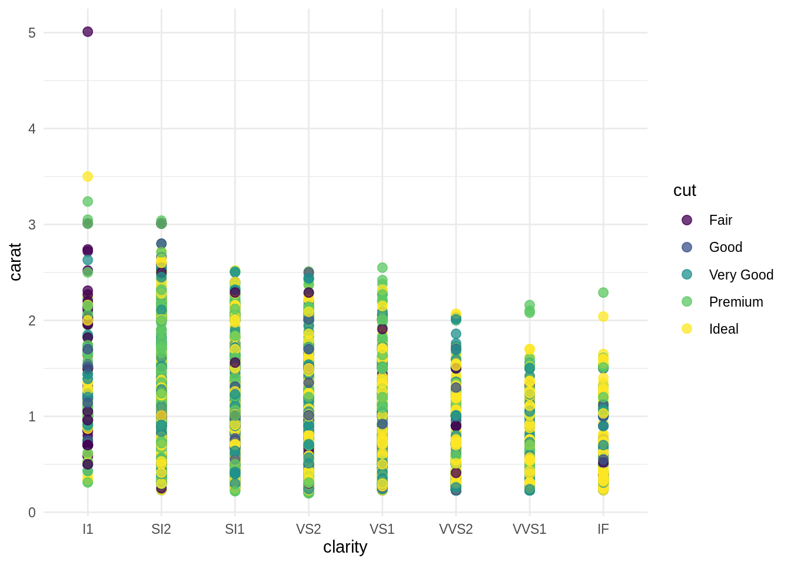
  
  
  There are several other packages available that set the themes and colors in many ways. We will discuss 4 of them.
  
  1. RColorBrewer
  2. ggthemes
  3. ggthemr
  4. ggsci
  
  
## RColorBrewer 

Often, we find ourselves looking for the colors which make our graph look clear and cool.  

RColorBrewer offers a number of palettes, which we can use based on the context of our graph. There are **three** categories of these palettes: *Sequential*, *Diverging*, and *Qualitative*


```r
q <- ggplot(subset, aes(x = clarity, y = carat, color = cut)) +
  geom_point(size = 2.5, alpha = 0.75) 
```

- **Sequential Palette**: It represents the shade of the color from light to dark. It is usually used to represent interval data where low values can be shown with a light color and high values can be shown with a dark color. For instance --Blues, BuPu, YlGn, Reds, OrRd


```r
q + scale_colour_brewer(palette = "Blues")
```

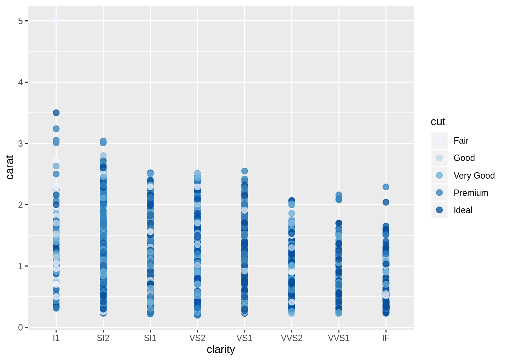

- **Diverging Palette**: It has darker colors of contrasting hues on both the ends, and lighter color in the middle. For instance --Spectral, RdGy, PuOr


```r
q + scale_colour_brewer(palette = "PuOr")
```

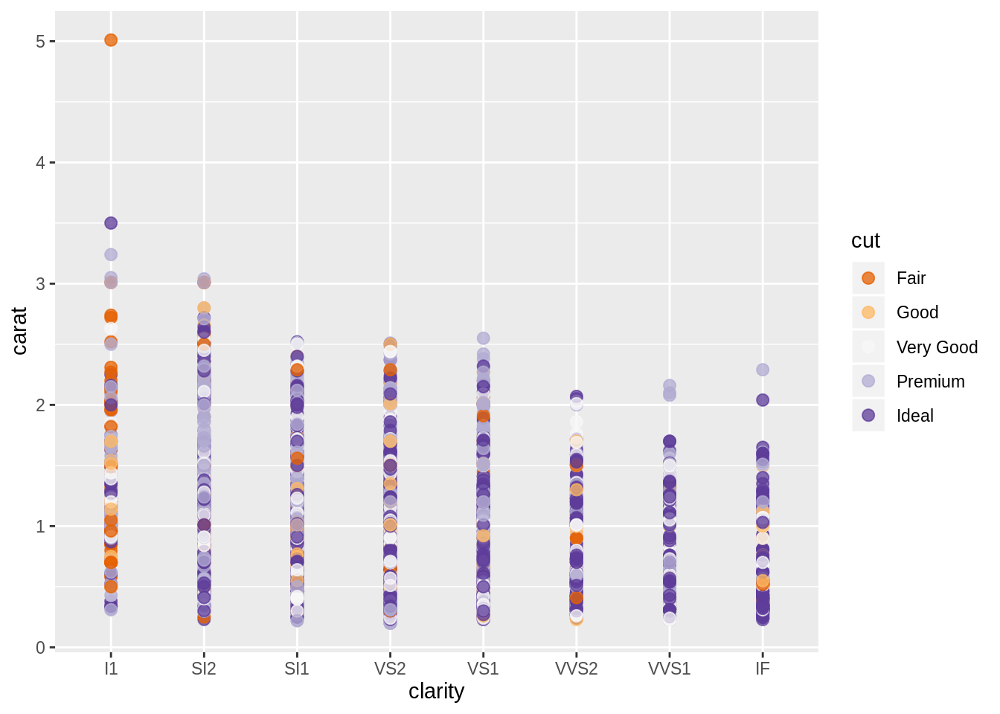

- **Qualitative Palette**: It is usually used when we want to highlight the differences in the classes (categorial variables). For instance --set1, set2, set3, pastel1, pastel2 , dark2
  

```r
q + scale_colour_brewer(palette = "Pastel1")
```

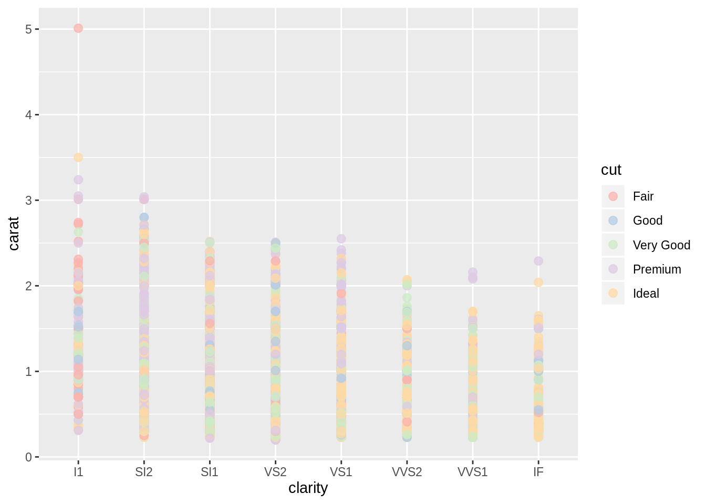

## ggthemes

**ggthemes** provides additional geoms, scales, and themes to `ggplot2`. Some of them are really cool! We can change the theme and color of a graph based on the context.


```r
g1 <- ggplot(subset, aes(x = clarity, y = carat, color = cut)) +
  geom_point(size = 2.5,alpha = 0.75) 
```

### ggthemes examples


```r
g1 + theme_economist() + scale_colour_economist()
```

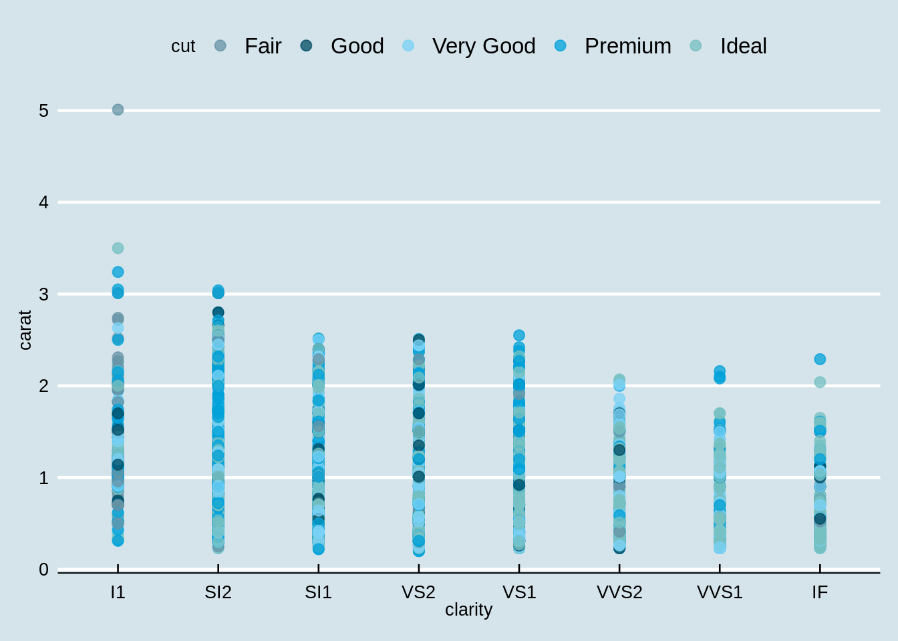


```r
g1 + theme_igray() + scale_colour_tableau()
```

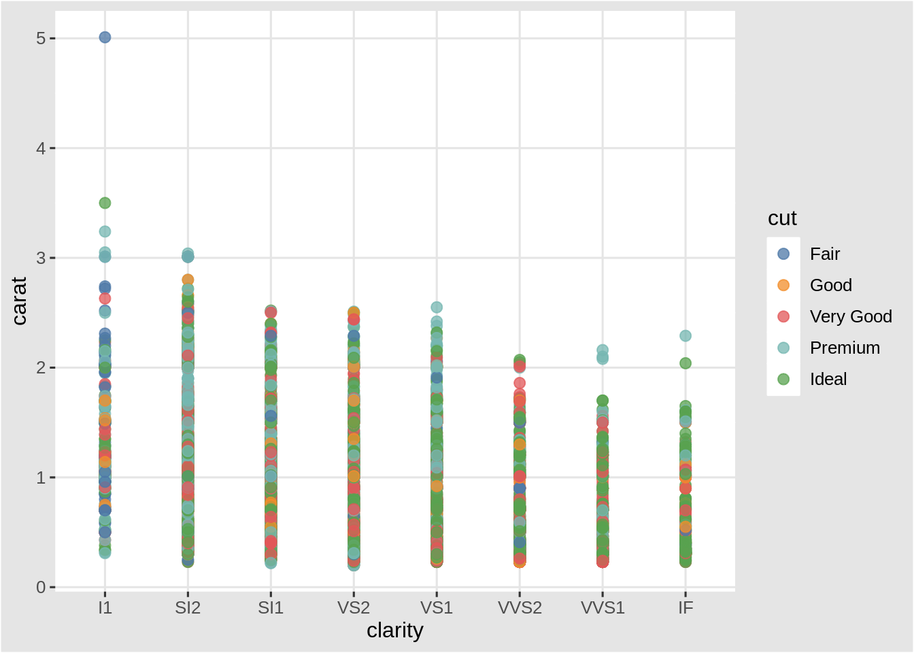


```r
g1 + theme_wsj() + scale_color_wsj()
```

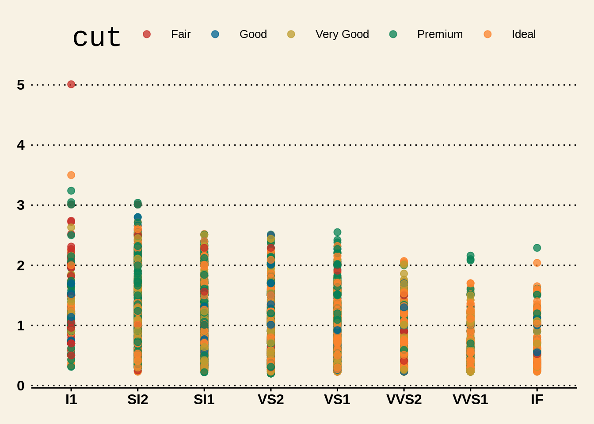


```r
g1 + theme_igray() + scale_colour_colorblind()
```

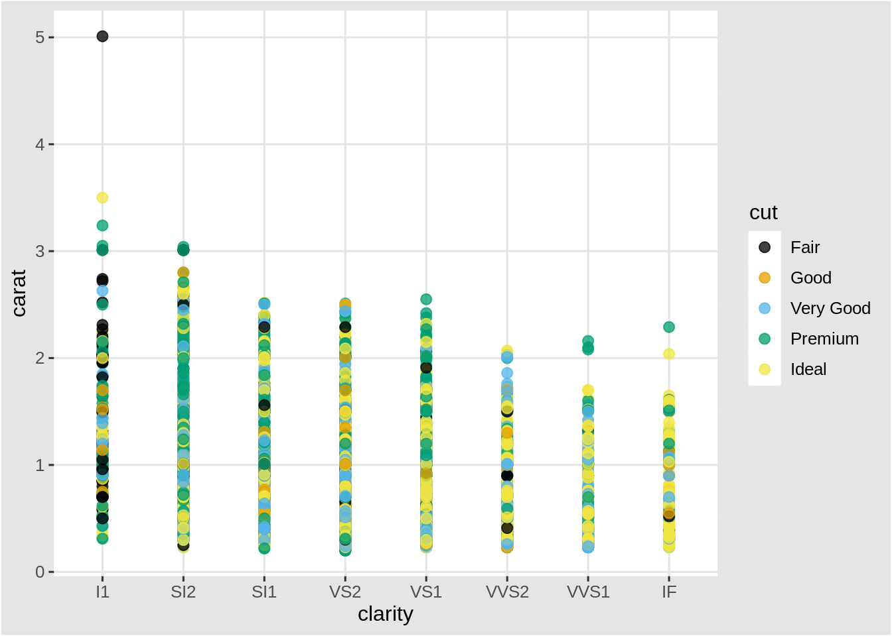

If we would like to use these colors in the graphs, which may not support using `ggthemes`, we can use the `scales` package to know what colors were used for a given palette. For example:


```r
show_col(colorblind_pal()(6))
```

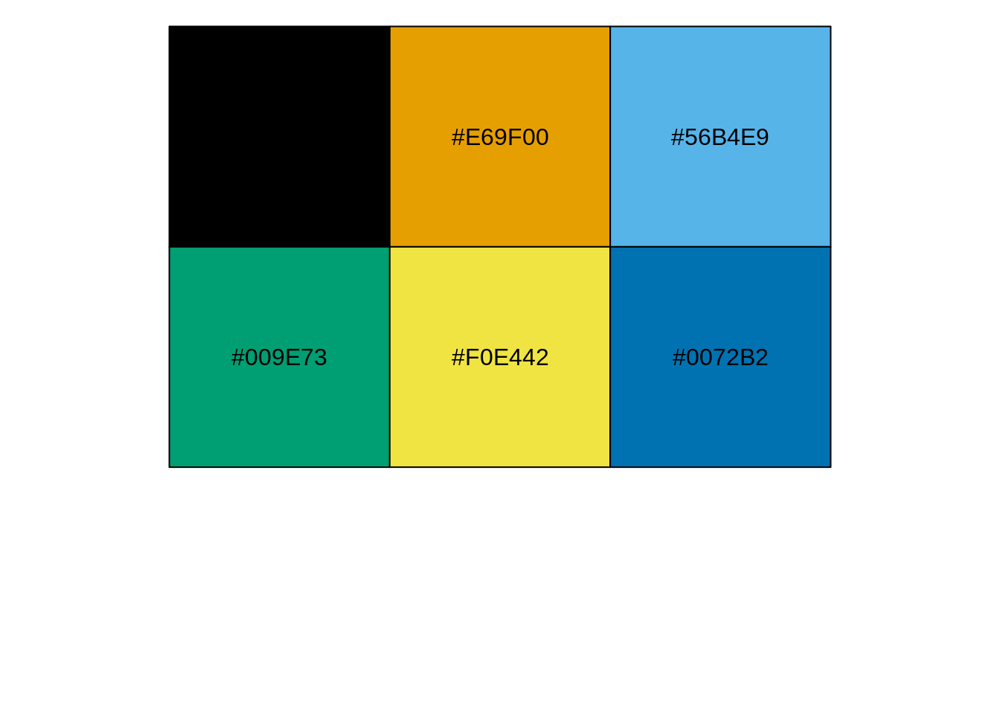

## ggthemr

**ggthemr** is used to set the theme of ggplot graphs. It has 17 different themes to change the way ggplot graphs look. Use of ggthemr is different from other other packages. We set the theme *before* using it. 

### ggthemr examples


```r
ggthemr("sky")
```

```
## Warning: New theme missing the following elements: axis.ticks.length.x,
## axis.ticks.length.x.top, axis.ticks.length.x.bottom, axis.ticks.length.y,
## axis.ticks.length.y.left, axis.ticks.length.y.right
```

```r
ggplot(subset, aes(x = clarity, y = carat, color = cut)) +
  geom_point(size = 2.5, alpha = 0.75)
```

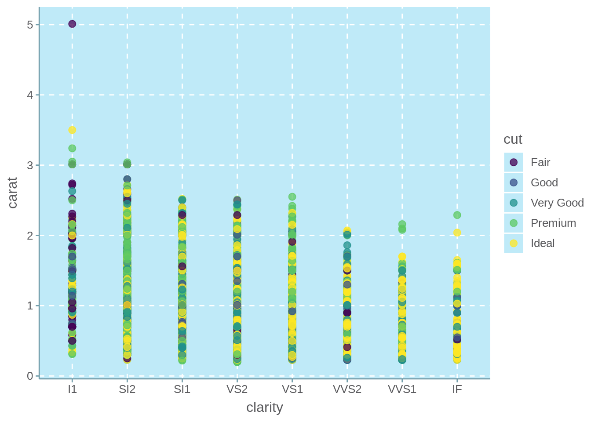


```r
ggthemr("flat")
```

```
## Warning: New theme missing the following elements: axis.ticks.length.x,
## axis.ticks.length.x.top, axis.ticks.length.x.bottom, axis.ticks.length.y,
## axis.ticks.length.y.left, axis.ticks.length.y.right
```

```r
ggplot(subset, aes(x = clarity, y = carat, color = cut)) +
  geom_point(size = 2.5, alpha = 0.75)
```

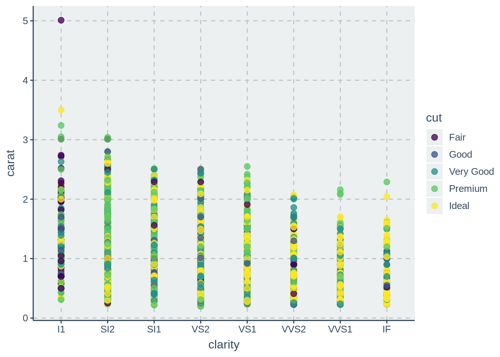

Interestingly, we can set more parameters to change the themes:


```r
ggthemr("lilac", type = "outer", layout = "scientific", spacing = 2)
```

```
## Warning: New theme missing the following elements: axis.ticks.length.x,
## axis.ticks.length.x.top, axis.ticks.length.x.bottom, axis.ticks.length.y,
## axis.ticks.length.y.left, axis.ticks.length.y.right
```

```r
ggplot(subset, aes(x = clarity, y = carat, color = cut)) +
  geom_point(size = 2.5, alpha = 0.75)
```

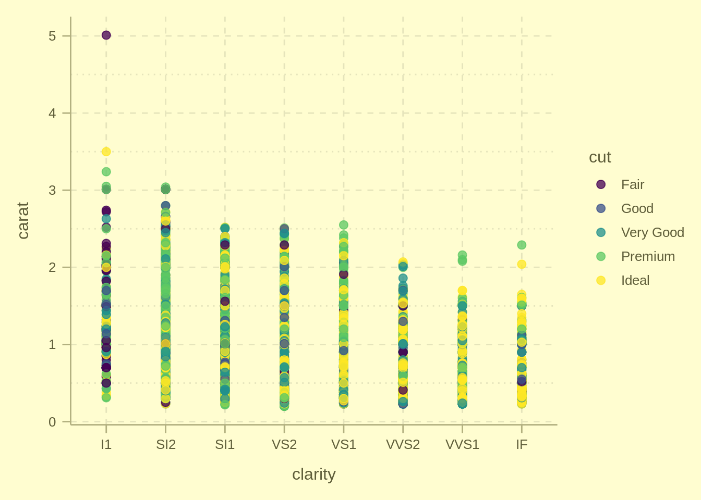

## ggsci

**ggsci** offers a number of palettes inspired by colors used in scientific journals, science fiction movies, and TV shows. For continous data, `scale_fill_material(colname)` is used, and for discrete data, `scale_color_palname()` or `scale_fill_palname()` are used. 

### ggsci for discrete data


```r
# we need to remove the theme set previously if we don't want to use it anymore
ggthemr_reset()

g1 <- ggplot(subset, aes(x = clarity, y = carat, color = cut)) +
  geom_point(size = 2.5, alpha = 0.75)

g1 + scale_color_startrek()
```

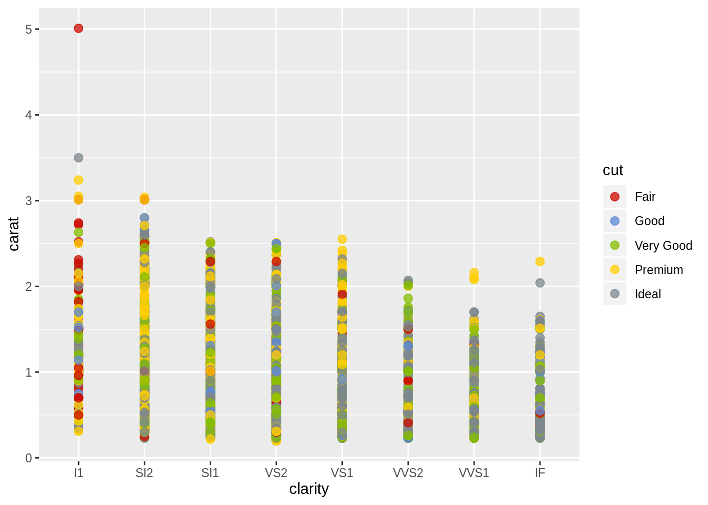


```r
g1 + scale_color_jama()
```

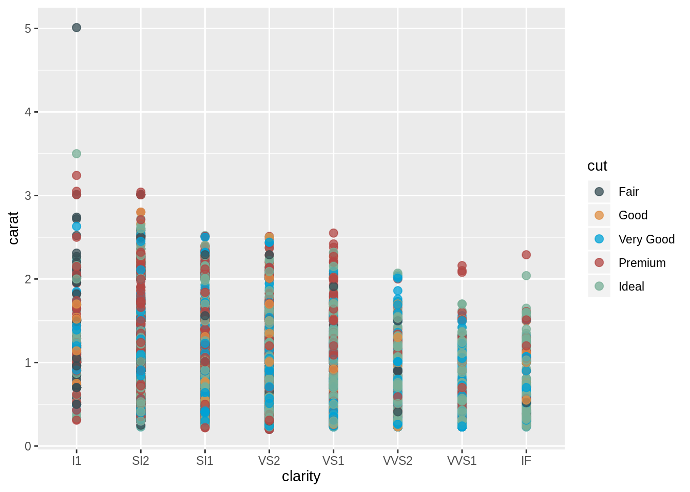


```r
g1 + scale_color_locuszoom()
```


### ggsci for continuous data


```r
ggplot(diamonds, aes(carat, price)) +
  geom_hex(bins = 20, color = "red") +
  scale_fill_material("orange")
```

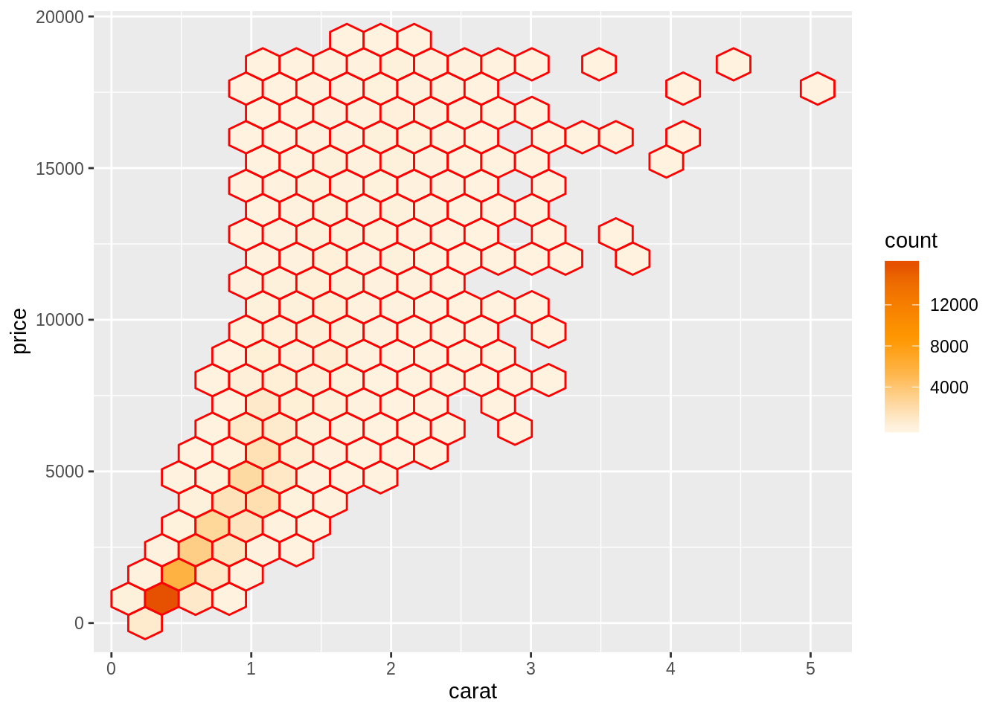

We can also find out the color used, so that we can use them in some other graphs created in base R:


```r
palette = pal_lancet("lanonc", alpha = 0.7)(9)
show_col(palette)
```

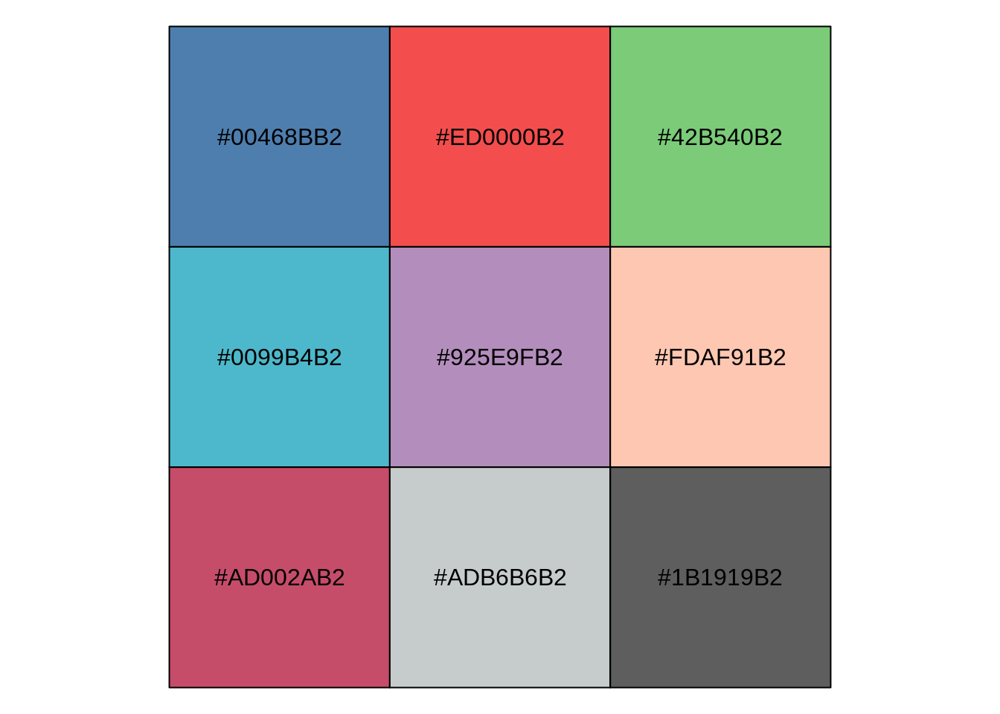

## External Resources 

- [RColorBrewer](https://data.library.virginia.edu/setting-up-color-palettes-in-r/){target="_blank"}: Setting up Color Palettes in R
- [ggthemes](https://yutannihilation.github.io/allYourFigureAreBelongToUs/ggthemes/){target="_blank"}: Github page containing more examples 
- [ggthemr](https://github.com/cttobin/ggthemr){target="_blank"}: Github Repository of the package
- [ggsci](https://cran.r-project.org/web/packages/ggsci/vignettes/ggsci.html){target="_blank"}: Scientific Journal and Sci-Fi Themed Color Palettes for ggplot2
